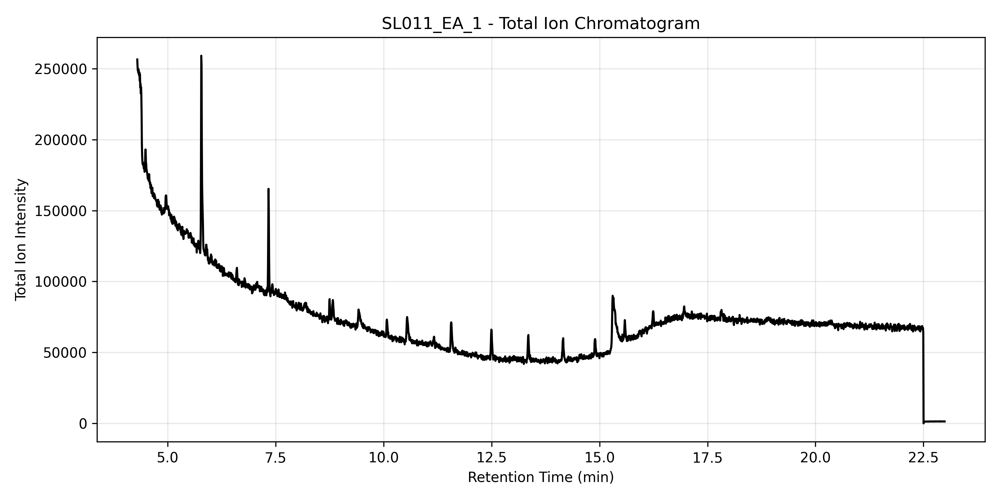
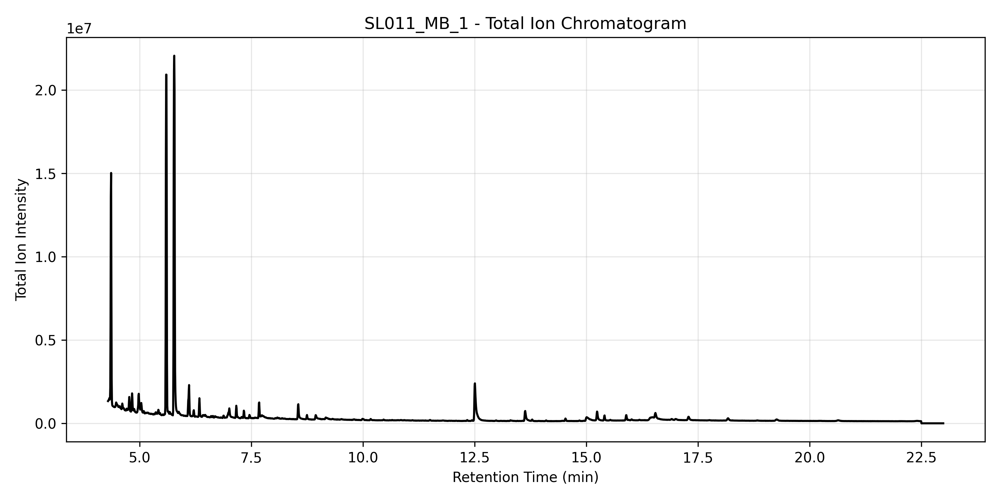
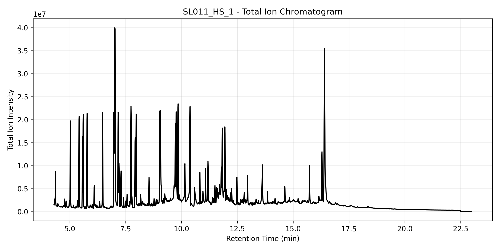

# < Ionome >
**Ionome** is an LC–MS data analysis pipeline designed for exploratory metabolomics, peak extraction, and automated chromatographic processing.  
The long-term goal of this project is to provide a modular, reproducible workflow for working with mzML files, extracting XICs, computing TIC/BPC, managing datasets, and generating a final report.

This repository currently focuses on:
- A clean, versioned Python codebase (starting with **Ver_1.0.0**)  
- Core readers/controllers for mzML processing  
- Chromatogram generation (TIC, BPC, XIC)
- Jupyter-based exploratory analysis

More components (peak deconvolution, automated annotation, QC workflows, dataset comparison utilities, and a full CLI) will be added as development continues.

---
## Development Status

**Ver 1.0.0:**

mzML loading  
TIC/BPC computation  
Basic XIC extraction  
Quality control plots (Total Ion Chormatograms & Base Peak Chromatograms)  
Preliminary metadata dictionaries  
Jupyter notebook exploration  

**Next goals ( Ver 1.1.0 ) :**

Peak detection and deconvolution (currently working on)  
Compound annotation tables  
Sample comparison (e.g., SL005 vs SL011)  
Batch pipelines for entire datasets  
Cleaner controller abstractions  
Auto-QC metrics (noise, intensity drift, retention time shifts)  

### Dataset using to test the package:
> **Little AS, Younker IT, Schechter MS, Bernardino PN, Méheust R, Stemczynski J, Scorza K, Mullowney MW, Sharan D, Waligurski E, Smith R, Ramanswamy R, Leiter W, Moran D, McMillin M, Odenwald MA, Iavarone AT, Sidebottom AM, Sundararajan A, Pamer EG, Eren AM, Light SH.**  
*Dietary- and host-derived metabolites are used by diverse gut bacteria for anaerobic respiration.*  
Nat Microbiol. 2024 Jan;9(1):55-69. Epub 2024 Jan 4.  
https://massive.ucsd.edu/ProteoSAFe/dataset_files.jsp?task=365b6b62ef34444c821aff7d6ff9e499#%7B%22table_sort_history%22%3A%22main.collection_asc%22%2C%22main.collection_input%22%3A%22peak%7C%7CEXACT%22%7D

## Installation
**Status:** _Currently in development — not yet distributed as a package._

Current dependencies for `Ionome` are as follows:

pandas~=2.3.3  
pymzml~=2.5.11  
matplotlib~=3.10.7  
PyYAML~=6.0.3  
numpy~=2.3.4  
tqdm~=4.67.1  
pyarrow
fastparquet

## Usage
Quick step-by-step for how the package works.    
### Repository Structure
```
ionome/  
│  
├── src/  
│   ├── correct_baseline.py     # BaselineCorrection class  
│   ├── helpers.py              # helper functions  
│   ├── ionome_core.py          # class Controller  
│   ├── main.py                 # XICExtractor and helpers  
│   ├── paths.py                # path module  
│   ├── peakDetection.py        # PeakDetection class  
│   ├── preprocess.py           # MzmkParser class  
│   ├── sampleMetaData.py       # SampleMetaData Controller
│   └── visualization.py        # Chromatogram class  
│  
├── notebooks/  
│   └── 01_explore_single_file.ipynb  
│  
├── data/  
│   ├── raw/                   # raw mzML files (gitignored)  
│   └── processed/             # cleaned or exported tables  
│  
├── scripts/  
│   └── download_data.py       # pulls MassIVE files programmatically  
│  
├── results/                   # figures, exports (gitignored)  
├── config/                    # metadata dictionaries, settings  
├── docs/                      # expanded documentation  
├── requirements.txt  
├── README.md  
├── LICENSE  
└── .gitignore  
```

### Running Ionome package
In order for this to work, you should have two files located in the `config` directory:  
- <details>
    <summary>see config example</summary>

    ```yaml
    # config.yaml

    # General pipeline settings
    rerun: false
    save_parquet: true
    verbose: true
    
    # Paths
    data_dir: "data/raw"
    cached_dir: "data/processed"
    results_dir: "results"
    logs_dir: "logs"
    
    # Metabolites for analysis
    target_mz_list:
      p-coumerate: 163.04007
      urocanate: 137.03565
      caffeate: 179.03498
      cinnamate: 147.04460
      ferulate: 193.05009
      sinapate: 223.06065
    
    # tolerance for mz detection
    target_mz_params:
      tol: 0.01
    
    # Parsing and preprocessing of mzML files
    parser:
      ms_level: 1
    
    # Baseline correction parameters
    baseline:
      method: asls
      asls:
        lambda: 1e5
        p: 0.01
        niter: 10
        tol: 1e-6
      snip:
        window: 5
        precision: 9
        clip_negatives: true
    
    # Peak detection parameters
    peak_detection:
      window: 5
      precision: 9
      prominence: 0.01
      rel_height: 1
      buffer: 0
    
    # Plotting options
    plotting:
      tic: true
      bpc: true
      xic: true
      save_figures: true

    ```
  </details>

- <details>
    <summary>see sample list example</summary>
    
    ```yaml
    samples:
      - unique_id: SL011_EA_1
        id: SL011
        file: 031__20210415__SL011__EA_Blank__nosplit.mzML
        condition: Control
        description: Extraction Blank
        replicate: 1
        species: H. filiformis
      
      - unique_id: SL011_PooledQC_1
        id: SL011
        file: 033__20210415__SL011__PooledQC__nosplit.mzML
        condition: Control
        description: Pooled quality control
        replicate: 1
        species: H. filiformis
      
      - unique_id: SL011_HS_1
        id: SL011
        file: 045__20210415__SL011__HS1__nosplit.mzML
        condition: Treatment
        description: Sample
        replicate: 1
        species: H. filiformis
  
    ```
  </details>  

You can then run `Ionome` class object to initialize the workflow.

```python
from src.ionome_core import Ionome
example = Ionome(run_id="SL011", samples="samples_SL011.yaml")
```

    >[2025-11-17 06:11:16][Ionome.__init__]
    	Initializing run ID SL011 for analysis

Then you can load the spectra data from mzml files using `load.data()`:

```python
example.load_data()
```

    >[2025-11-19 17:49:44][Ionome.load_data]
    	> Loading spectra data for sample SL011_EA_1...
    	  Using cached file
    	> Loading spectra data for sample SL011_MB_1...
    	  Using cached file
    	> Loading spectra data for sample SL011_HS_1...
    	  Using cached file
    	...


You can also check each individual dataframes by `.data['sample_name']`

```python
ea_1_df = example.data['SL011_EA_1'] # extraction blank control
ea_1_df
```
|         | ms_level | scan_id | retention_time | intensity |     mz |
|--------:|---------:|--------:|---------------:|----------:|-------:|
|       0 |        1 |       1 |        4.29355 |   430.934 |  50.12 |
|       1 |        1 |       1 |        4.29355 |   836.703 |  50.91 |
|       2 |        1 |       1 |        4.29355 |   1448.42 |  52.04 |
|       3 |        1 |       1 |        4.29355 |   293.509 |  52.96 |
|       4 |        1 |       1 |        4.29355 |   341.261 |  54.09 |
|     ... |      ... |     ... |            ... |       ... |    ... |
| 1889741 |        1 |    2990 |        22.9909 |   4.43263 |  595.7 |
| 1889742 |        1 |    2990 |        22.9909 |   3.41086 | 596.93 |
| 1889743 |        1 |    2990 |        22.9909 |  0.733822 | 597.76 |
| 1889744 |        1 |    2990 |        22.9909 |   1.92111 | 598.36 |
| 1889745 |        1 |    2990 |        22.9909 |  0.810828 | 599.46 |

```python
hs_1_df = example.data['SL011_HS_1'] # sample
hs_1_df

```
|         | ms_level | scan_id | retention_time | intensity |     mz |
|--------:|---------:|--------:|---------------:|----------:|-------:|
|       0 |        1 |       1 |        4.29338 |   23233.4 |  50.04 |
|       1 |        1 |       1 |        4.29338 |   35742.2 |  51.04 |
|       2 |        1 |       1 |        4.29338 |   91149.1 |  52.04 |
|       3 |        1 |       1 |        4.29338 |   11119.5 |  53.03 |
|       4 |        1 |       1 |        4.29338 |   1989.25 |  54.03 |
|     ... |      ... |     ... |            ... |       ... |    ... |
| 1735420 |        1 |    2990 |        22.9907 |   2.73713 | 595.63 |
| 1735421 |        1 |    2990 |        22.9907 |   1.62367 | 596.56 |
| 1735422 |        1 |    2990 |        22.9907 |   3.17359 | 597.72 |
| 1735423 |        1 |    2990 |        22.9907 |   2.93057 | 598.67 |
| 1735424 |        1 |    2990 |        22.9907 |   1.03776 | 599.26 |

### Quality Control plots
To plot and visualize basic quality control plots, use `plot_chromatogram('tic')` to show Total Ion Chromatograms (TIC plots)
```python
example.plot_chromatogram("tic")
```





## LICENSE

MIT License — see LICENSE for details.
