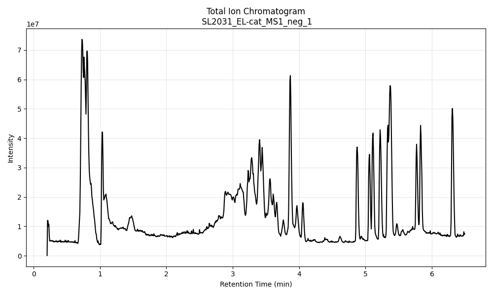
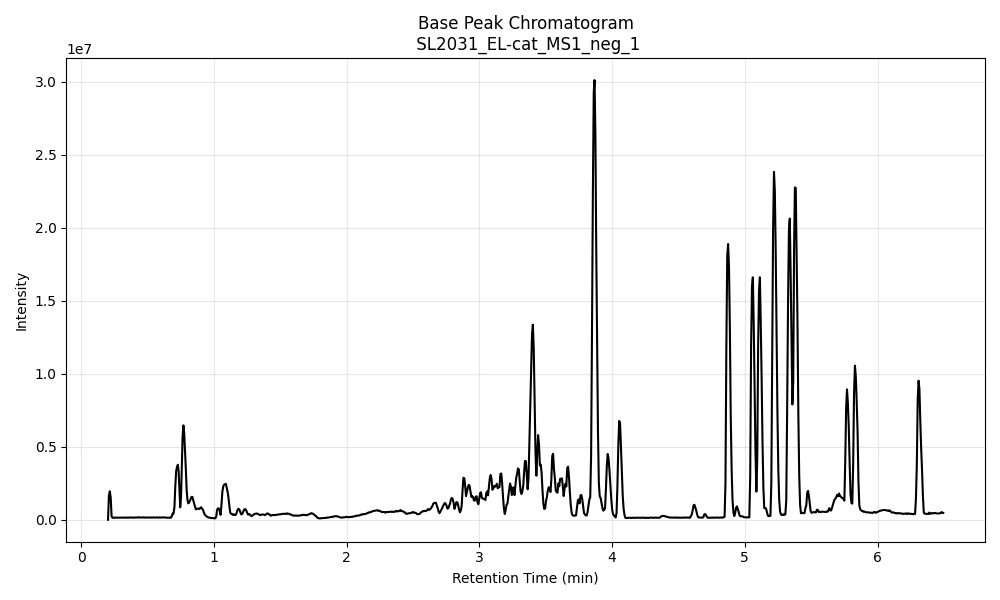
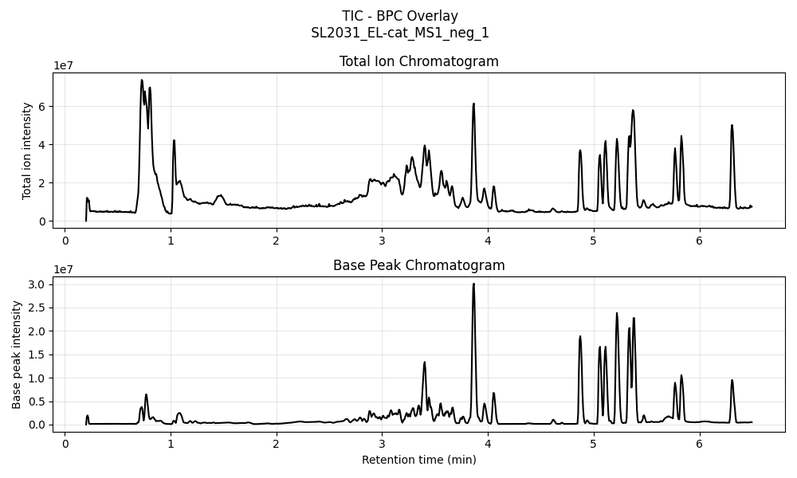
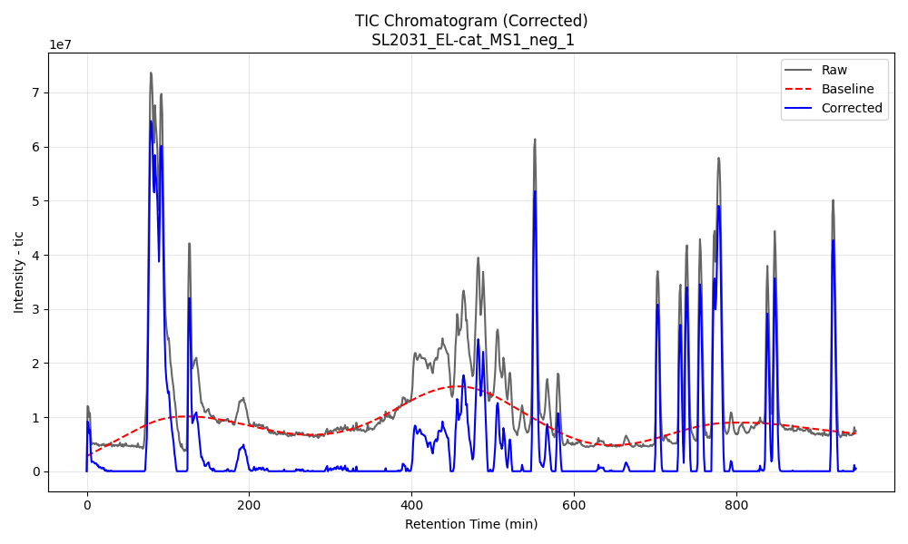
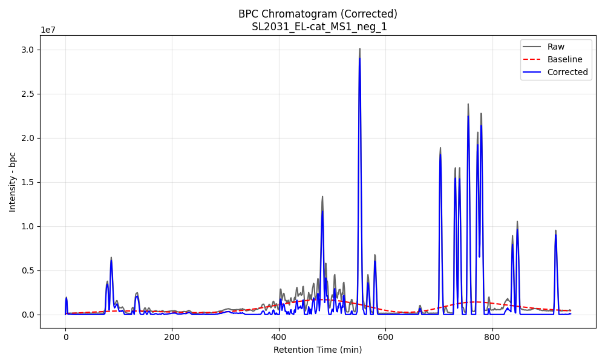
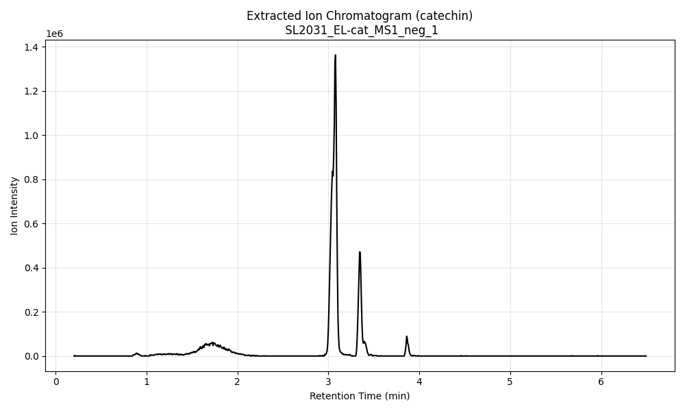

# < Ionome >

---
[](./LICENSE)
[](https://www.repostatus.org/#wip)


**Ionome** is an LC–MS data analysis pipeline designed for exploratory metabolomics, peak extraction, and automated chromatographic processing.  
The long-term goal of this project is to provide a modular, reproducible workflow for working with mzML files, extracting XICs, computing TIC/BPC, managing datasets, and generating a final report.

This repository currently focuses on:
- A clean, versioned Python codebase (starting with **Version 1.0.0**)  
- Core readers/controllers for mzML processing  
- Chromatogram generation (TIC, BPC, XIC, baseline corrected chromatograms)
- Peak detection
- Summary report

More components (automated annotation, QC workflows, dataset comparison utilities, and a full CLI) will be added as development continues.

---
## Development Status

**Ver 1.0.0:**

mzML loading  
Save parsed mzML files as `.parquet` files for caching  
TIC/BPC computation  
XIC extraction  
Quality control plots (Total Ion Chromatograms & Base Peak Chromatograms & corrected plots)  
Preliminary metadata summary
Peak Detection

**Next goals ( Ver 1.1.0 ) :**

Compound annotation tables  
Sample comparison (e.g., SL005 vs SL011)  
Batch pipelines for entire datasets  
Cleaner controller abstractions  
Auto-QC metrics (noise, intensity drift, retention time shifts)  

---
## Installation
**Status:** _Currently in development — not yet distributed as a package._

Current dependencies for `Ionome` are as follows:

pandas~=2.3.3  
pymzml~=2.5.11  
matplotlib~=3.10.7  
PyYAML~=6.0.3  
numpy~=2.3.4  
tqdm~=4.67.1  
pyarrow
fastparquet

---
## Usage
Quick step-by-step for how the package works. 

### Repository Structure
```
ionome/  
│  
├── src/  
│   └── script files
│   
├── projects/                 
│   └── runid/  
│       ├── logs/             
│       ├── processed/        
│       ├── raw_data/         
│       ├── results/          
│       ├── config_runid.yam  
│       └── samples_runid.yaml  
│   
├── config/                   
├── requirements.txt  
├── README.md  
├── LICENSE  
└── .gitignore  
```

### Running Ionome package
In order for this to work, you should have two files located in the `config` directory:
1. config.yaml
2. run_id_samples.csv (run_id should be the name of your experiment/name of run,etc)
- <details>
    <summary>see config example</summary>

    ```yaml
    # config.yaml

    # General pipeline settings
    rerun: false
    
    # Paths
    data_dir: "raw_data"
    cached_dir: "processed"
    results_dir: "results"
    logs_dir: "logs"
    
    # Metabolites for analysis
    target_mz_list:
      catechin: 289.0718        # [M − H]⁻
    
    # tolerance for mz detection
    target_mz_params:
      ppm: 3
      da: 0.3
    
    # Parsing and preprocessing of mzML files
    parser:
      ms_level: 1
    
    # Baseline correction parameters
    baseline:
      method: asls
      asls:
        lambda: 1e6
        p: 0.1
        niter: 10
        tol: 1e-6
      snip:
        window: 5
        precision: 9
        clip_negatives: true
    
    # Peak detection parameters
    peak_detection:
      window: 5
      precision: 9
      prominence: 0.01
      rel_height: 1
      buffer: 0
    
    # Plotting options
    plotting:
      tic: true
      bpc: true
      tic_and_bpc: true
      corrected: true
      xic: true
    
    plotting_params:
      corrected:
        plot_types: ["tic", "bpc"]
      xic:
        metabolites: "all"
    ```
  </details>

- <details>
    <summary>see sample list example</summary>
    
    ```csv
    id,file,condition,description,replicate,species
    SL2031,024_20230825_SL2031__SW-cat_MS1_neg.mzML,Treatment,Sample,1,S. wadsworthensis
    SL2031,018_20230825_SL2031__EL-cat_MS1_neg.mzML,Treatment,Sample,1,E. lenta
    SL2031,019_20230825_SL2031__EL-cat_MS2_neg.mzML,Treatment,Sample,2,E. lenta
    SL2031,003_20230825_SL2031__MB_MS1_neg.mzML,Control,Method Blank,1,E. lenta
    SL2031,004_20230825_SL2031__MB_MS2_neg.mzML,Control,Method Blank,2,E. lenta
   ```
  </details>  
#### [1.] Project Setup

Run `IonomeProjectSetup().create_project("run_id", sample_table="run_id_samples.csv")`  

```python
from src.project_setup import IonomeProjectSetup
IonomeProjectSetup().create_project(project_name="SL2031", sample_table="SL2031_samples.csv")
```

    >[2025-12-18 04:26:08][IonomeProjectSetup.__init__]
    >[2025-12-18 04:26:08][IonomeProjectSetup.create_project]
	  [>] Project 'SL2031' created successfully.
       Follow these steps:
       [1.] Before running 'Ionome', manually copy data files into the raw_data folder/directory.
       [2.] Check and edit the config_SL2031.yaml file if necessary.
       [3.] Confirm the samples_SL2031.yaml file has all the samples data.
       [4.] Run Ionome('SL2031', 'samples_SL2031.yaml')

Follow the steps listed.

#### [2.] Project initialization
Run `Ionome(run_id="run_id", samples="samples_run_id.yaml")` class object to initialize the workflow.
```python
from src.ionome_core import Ionome
example = Ionome(run_id="SL2031", samples="samples_SL2031.yaml")
```

    >[2025-12-18 04:26:08][Ionome.__init__]
      > Initializing run ID SL2031 with 5 samples:
        → SL2031_SW-cat_MS1_neg_1 (Sample | rep 1 | species S. wadsworthensis)
        → SL2031_EL-cat_MS1_neg_1 (Sample | rep 1 | species E. lenta)
        → SL2031_EL-cat_MS2_neg_2 (Sample | rep 2 | species E. lenta)
        → SL2031_MB_MS1_neg_1 (Method blank | rep 1 | species E. lenta)
        → SL2031_MB_MS2_neg_2 (Method blank | rep 2 | species E. lenta)

#### [3.] Loading of data from mzML files
Load the spectra data from mzml files using `load.data()`:

```python
example.load_data()
```

    >[2025-12-18 04:36:10][Ionome.load_data]
      > Loading spectra data:
       ✓ 024_20230825_SL2031__SW-cat_MS1_neg.mzML
       ✓ 018_20230825_SL2031__EL-cat_MS1_neg.mzML
       ✓ 019_20230825_SL2031__EL-cat_MS2_neg.mzML
       ✓ 003_20230825_SL2031__MB_MS1_neg.mzML
       ✓ 004_20230825_SL2031__MB_MS2_neg.mzML

#### [4.] Extract quality control data for QC plots
Generates the required dataframe for QC plotting using `extract_quality_control()`

```python
example.extract_quality_control()
```

    >[2025-12-18 04:36:24][Ionome.extract_quality_control]
      > Extracting quality control data (TIC,BPC):
        ✓ SL2031_SW-cat_MS1_neg_1
        ✓ SL2031_EL-cat_MS1_neg_1
        ✓ SL2031_EL-cat_MS2_neg_2
        ✓ SL2031_MB_MS1_neg_1
        ✓ SL2031_MB_MS2_neg_2

#### [5.] Extract XIC data per metabolite listed
Filters the dataframe for each target m/z values from `run_id_config.yaml` file
```python
example.extract_ion_chromatograms()
```

    >[2025-12-18 04:36:25][Ionome.extract_ion_chromatograms]
      > Extracting XIC chromatogram data:
        SL2031_SW-cat_MS1_neg_1 --> {'catechin': 289.0718}
            ✓ catechin (289.0718): tol=0.000867 Da, hits=359
        SL2031_EL-cat_MS1_neg_1 --> {'catechin': 289.0718}
            ✓ catechin (289.0718): tol=0.000867 Da, hits=297
        SL2031_EL-cat_MS2_neg_2 --> {'catechin': 289.0718}
            ✓ catechin (289.0718): tol=0.000867 Da, hits=265
        SL2031_MB_MS1_neg_1 --> {'catechin': 289.0718}
            ✓ catechin (289.0718): tol=0.000867 Da, hits=32
        SL2031_MB_MS2_neg_2 --> {'catechin': 289.0718}
            ✓ catechin (289.0718): tol=0.000867 Da, hits=30

#### [6.] Baseline correction
Removes noise from data, needs to be called per chromatogram you wish to correct with `correct_baseline(chromatogram_type)`
```python
example.correct_baseline("tic")
example.correct_baseline("bpc")
example.correct_baseline("xic")
```

    >[2025-12-18 04:36:24][Ionome.correct_baseline]
      > Correcting tic chromatogram baseline using 'asls' method:
        ✓ SL2031_SW-cat_MS1_neg_1
        ✓ SL2031_EL-cat_MS1_neg_1
        ✓ SL2031_EL-cat_MS2_neg_2
        ✓ SL2031_MB_MS1_neg_1
        ✓ SL2031_MB_MS2_neg_2

    >[2025-12-18 04:36:25][Ionome.correct_baseline]
      > Correcting bpc chromatogram baseline using 'asls' method:
        ✓ SL2031_SW-cat_MS1_neg_1
        ✓ SL2031_EL-cat_MS1_neg_1
        ✓ SL2031_EL-cat_MS2_neg_2
        ✓ SL2031_MB_MS1_neg_1
        ✓ SL2031_MB_MS2_neg_2

    >[2025-12-18 04:36:25][Ionome.correct_baseline]
      > Correcting xic chromatogram baseline using 'asls' method:
        ✓ SL2031_SW-cat_MS1_neg_1
        ✓ SL2031_EL-cat_MS1_neg_1
        ✓ SL2031_EL-cat_MS2_neg_2
        ✓ SL2031_MB_MS1_neg_1
        ✓ SL2031_MB_MS2_neg_2

#### [7.] Peak detection
Automatically tries to detect peaks from XIC data, `peak_detection()`
```python
example.peak_detection()
```

    >[2025-12-18 04:36:25][Ionome.peak_d]
	  > Detecting peaks in XIC Chromatograms:
    >[2025-12-18 04:36:25][DetectPeaks.detect_peaks]
	   Finished deconvolution: 100%|█████████████████| 4/4 [00:00<00:00,  9.18it/s]

#### [8.] Plotting of chromatograms
Plots all available chromatograms, use `plot_chromatogram()`
```python
example.plot_chromatogram()
```

    >[2025-12-18 04:36:26][Ionome.plot_chromatogram]
      > Plotting Chromatograms:
        ✓ tic for SL2031_EL-cat_MS1_neg_1
        ✓ bpc for SL2031_EL-cat_MS1_neg_1
        ✓ tic_and_bpc for SL2031_EL-cat_MS1_neg_1
        ✓ corrected for SL2031_EL-cat_MS1_neg_1
        ✓ xic for SL2031_EL-cat_MS1_neg_1

|           Total Ion Chromatogram           |           Base Peak Chromatogram           |
|:------------------------------------------:|:------------------------------------------:|
|  |  |

| TIC - BPC                                      |
|:-----------------------------------------------|
|  |

|          Total Ion Chromatogram (Corrected)          |          Base Peak Chromatogram (Corrected)          |
|:----------------------------------------------------:|:----------------------------------------------------:|
|  |  |

| Extracted Ion Chromatogram                          |
|:----------------------------------------------------|
|  |

#### [9.] Summary Report
To look at the summary report, use `ionome.samples['sample_id'].summarize()  
Prints a quick summary of all current dataframes and metadata
```python
ionome.samples['SL2031_EL-cat_MS1_neg_1'].summartize()
```

    ------------------------------------------------------------
    Sample Summary for sample: SL2031_EL-cat_MS1_neg_1
    ------------------------------------------------------------
        --- Metadata ---
     batch_id    : SL2031
     condition   : Treatment
     species     : E. lenta
     replicate   : 1
    
        --- Data Containers & Shapes ---
     .raw                  (Shape: (982226, 5))
         ms_level            : (1, 1, 1, 1, 1)
         scan_id             : (1, 1, 1, 1, 1)
         retention_time      : (0.2030345504, 0.2030345504, 0.2030345504, 0.2030345504, 0.2030345504)
         intensity           : (1277.448486328125, 1243.3863525390625, 1294.443115234375, 1293.4158935546875, 1348.3358154296875)
         mz                  : (201.58956909179688, 203.3817138671875, 206.59169006347656, 211.20188903808594, 212.4447021484375)
     .quality_control      (Shape: (948, 10))
         scan_id             : (1, 2, 3, 4, 5)
         retention_time      : (0.2030345504, 0.209668530933, 0.216330321867, 0.222993905333, 0.2296752032)
         tic                 : (56061.86328125, 12045911.0, 11931071.0, 10031950.0, 10763100.0)
         bpc                 : (1837.5543212890625, 1656042.25, 1954991.5, 1533433.125, 254613.625)
         peaks_per_scan      : (38, 767, 808, 811, 1385)
         bpc_mz              : (689.7496337890625, 239.05934143066406, 239.05929565429688, 239.0592803955078, 320.885986328125)
         tic_baseline        : (2792250.250079534, 2871322.1178501286, 2950391.5230511753, 3029456.9205720145, 3108517.663369936)
         tic_corrected       : (0.0, 9174588.882149871, 8980679.476948824, 7002493.0794279855, 7654582.336630064)
         bpc_baseline        : (95730.9049316631, 98861.03125974465, 101991.07308381064, 105121.10161796742, 108251.37337636406)
         bpc_corrected       : (0.0, 1557181.2187402553, 1853000.4269161893, 1428312.0233820325, 146362.25162363594)
    
    .xic                  (Contains 1 entries)
      [catechin] (Shape: (948, 5))
         scan_id             : (1, 2, 3, 4, 5)
         retention_time      : (0.2030345504, 0.209668530933, 0.216330321867, 0.222993905333, 0.2296752032)
         intensity           : (0.0, 2275.997314453125, 0.0, 0.0, 0.0)
         baseline            : (-3236.314653717777, -3198.864595635201, -3161.414213921161, -3123.9626374580002, -3086.5086789866446)
         corrected           : (0.0, 5474.861910088326, 0.0, 0.0, 0.0)
    
    .unmixed_chromatograms (Contains 1 entries)
      [catechin] (Shape: (948, 5))
         Values (first 5)     : (0.0, 0.0, 0.0, 0.0, 0.0)
    
    .peaks_properties     (Contains 1 entries)
      [catechin] (4 entries)
      ...

## LICENSE

MIT License — see LICENSE for details.
